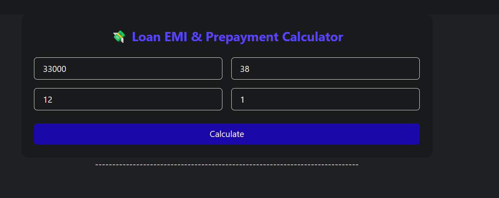
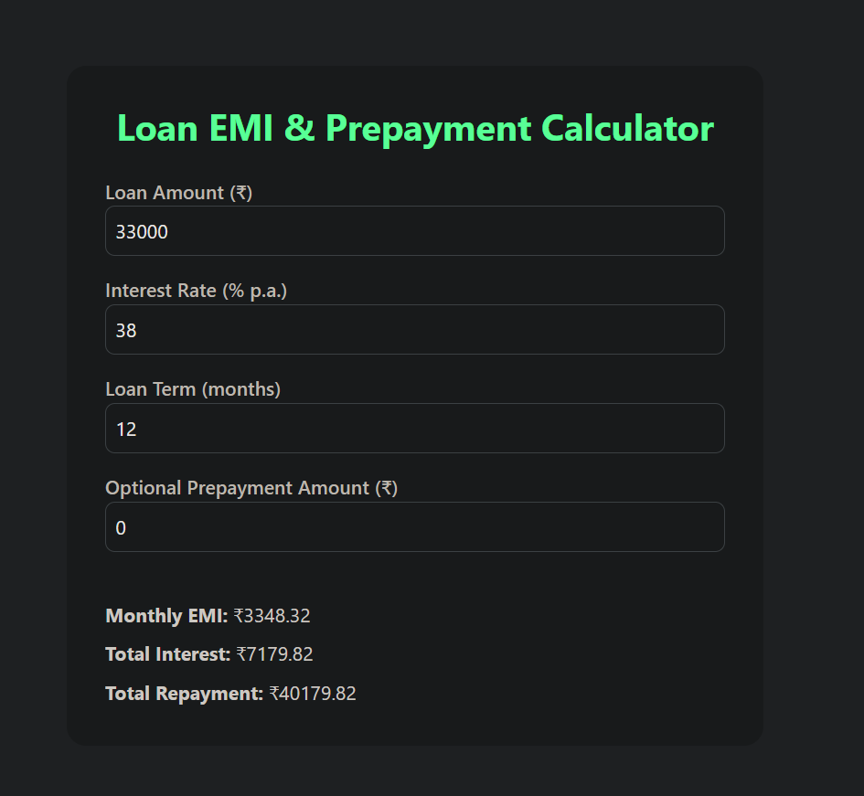

# 💸 Loan EMI & Prepayment Calculator

This is a simple and responsive Loan Calculator built using **React** and **Tailwind CSS**. It helps users calculate:

* Monthly EMI (Equated Monthly Installment)
* Total Interest Payable
* Total Repayment Amount
  And also supports **optional prepayment calculation** to estimate how much interest you can save by making a lump-sum payment.

---

## 🚀 Features

✅ Easy-to-use UI
✅ EMI calculation based on loan amount, interest rate, and term
✅ Optional prepayment input for accurate future planning
✅ Instant interest savings report
✅ Fully responsive & clean Tailwind UI

---

## 📸 Screenshot

> *
 *

---

## 🧮 Formula Used

**EMI Formula:**

```
EMI = [P × R × (1 + R)^N] / [(1 + R)^N – 1]
```

Where:

* P = Loan Amount
* R = Monthly Interest Rate
* N = Loan Term in months

---

## 🔧 How to Run

1. Clone the repo:

```bash
git clone https://github.com/Chetan1930/EMI-Calcuator.git
cd loan-calculator
```

2. Install dependencies:

```bash
npm install
```

3. Start the app:

```bash
npm run dev
```

---

## 🔗 Live Demo

> https://emi-c.netlify.app/

---

## 💡 Future Improvements

* Option to reduce loan tenure instead of EMI on prepayment
* Visualization with charts (EMI breakdown, interest timeline)
* Export to PDF or CSV

---

## 📦 Tech Stack

* ⚛️ React
* 🎨 Tailwind CSS
* 🧮 TypeScript

---

## 🧑‍💻 Author

Made with ❤️ by [Chetan Chauhan](https://github.com/chetan1930)
